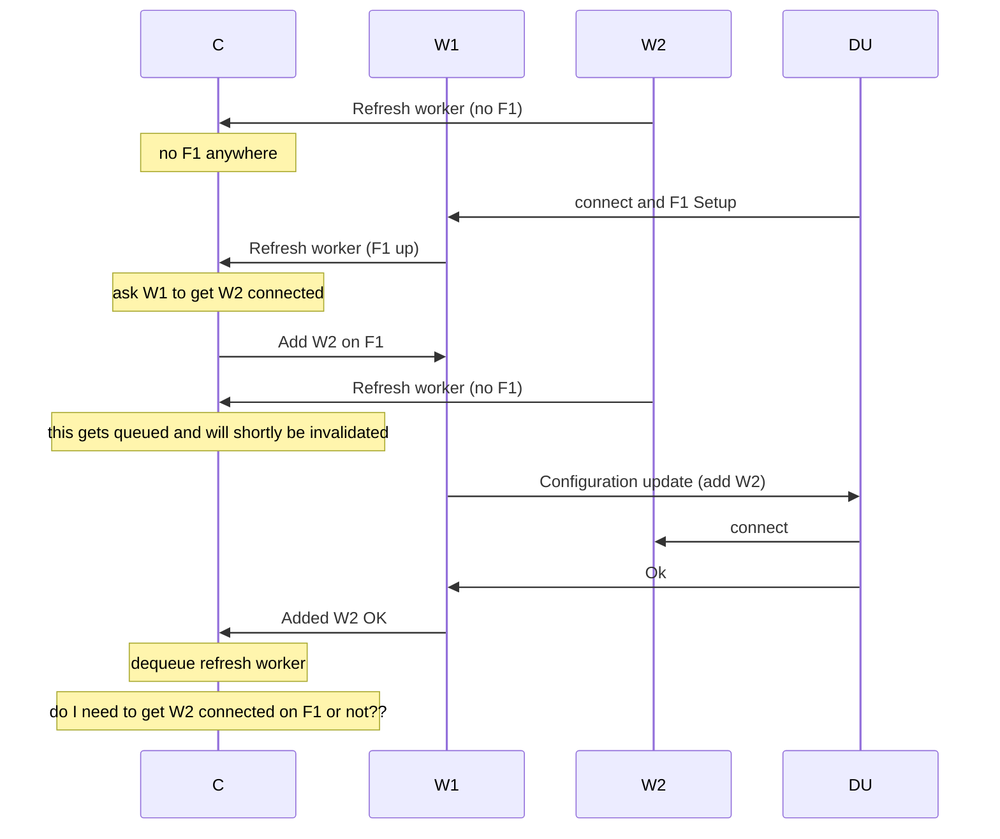
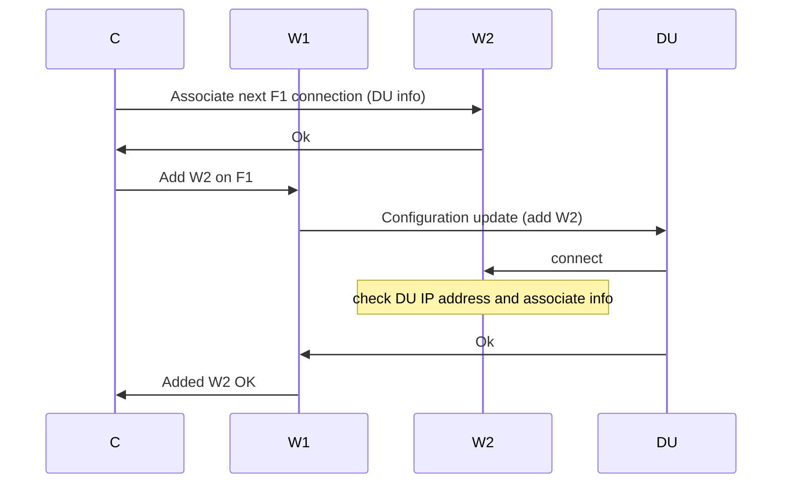
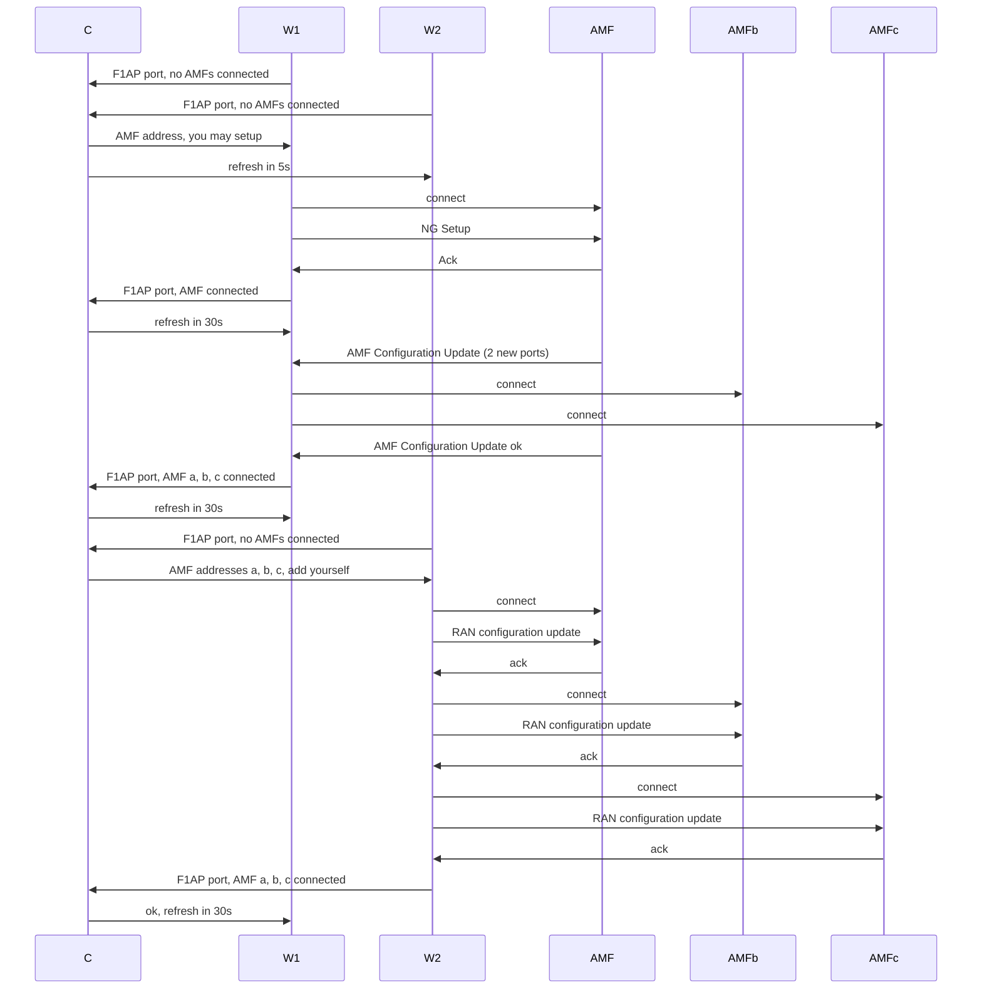

# Scale out connection management

Alsoran is a "scale out" gNB.  This means that a single logical gNB node consists of a number of interchangeable _workers_ that run on different servers in an active-active cluster, without any single point of failure.

## Multiple TNLAs

Alsoran makes use of a 5G feature called _multiple TNLAs_, which means that each Alsoran GNB-CU worker can have its own SCTP connection to the AMF, the GNB-CU-UP and the GNB-DU.  

It is by no means guaranteed that everyone will support this feature.  At the time of writing, neither free5GC nor Open5GS support multiple TNLAs.  Commercial AMFs may not support support multiple TNLAs either.  DUs and GNB-CU-UP implementations may not support it either.

It is technically possible to fail over a single SCTP connection between two processes by adding a second tier of proxies in front of them.  Such a design adds extra complexity to the system and incurs the inefficiency of extra signaling hops, and so is not a priority for Alsoran.  If you want to use Alsoran as a basis for a highly available, scale-out RAN, then you need to get a packet core, DU, and CU-UP that support multiple TNLAs. 

## The need for coordination

Alsoran workers need to be coordinated about how they set up and use the multiple TNLAs feature.  This section explains why.  

### Between GNB-CU and GNB-DU

As described in TS38.401, Multiple TNLAs for F1-C:

- GNB-CU must allow multiple associations from GNB-DU.
- GNB-CU may order GNB-CU to set up multiple associations to it using gNB-CU Configuration Update.

So, when we add the second and subsequent GNB-CU worker, we must send a gNB-CU Configuration Update with its address in.  The thing that sends that is an _existing_ worker.  So, when a new GNB-CU worker starts up, a different, existing worker must find out about that.

### Between AMF and GNB-CU

The NG-RAN node is allowed to create >1 SCTP connection to the AMF.  So once the NGAP interface is set up by the first worker, the second and subsequent workers can add their own connections.  In this case, they need to send RAN CONFIGURATION UPDATE (not NG SETUP):

> When the configuration with multiple SCTP endpoints per NG-RAN node is supported and the NG-RAN node wants to add additional SCTP endpoints, the RAN configuration update procedure shall be the first NGAP procedure triggered on an additional TNLA of an already setup NG-C interface instance after the TNL association has become operational, and the AMF shall associate the TNLA to the NG-C interface instance using the included Global RAN node ID.

There are a maximum of 32 (maxnoofTNLAssociations in NGAP ASN.1 - TS38.413).

The AMF may order us to open multiple associations to it.  Here we have another coordination requirement.  A single GNB-CU worker gets an AMF Configuration Update, but_multiple other workers should then open a connection to the same AMF SCTP endpoint.

## Coordinator design

To allow workers to coordinate, we provide a Coordinator process.  This serves a Coordinator API and controls workers' connections over a per worker Connection API.

The main characteristics of the Coordinator design are
  - it learns the current connection state from worker refreshes
  - it is based around a single-threaded actor (the control task) that stores coordination state in memory
    - at most one of it should exist at any time
  - it is not involved in any steady state operations - only in situations where the number of workers or the connections are in flux

TNLA coordination needs to be synchronized, which explains the use of the actor model.  (Alternatively a consistent store could be used, but that is not the current design.)  One example of why a synchronization mechanism is needed is that without synchronization, there would be a race condition in which two workers simultaneously connect and send NG Setup.

### Coordinator startup 

When the coordinator starts, it waits for a learning period before acting, to give it a chance to hear from all existing workers.
For speed of testing, this startup period can be skipped with the fast start configuration flag.  

### Mainline startup with two workers

### Fast initialization

Suppose the E1/F1 interface is initialized by E1/F1 Setup at a worker shortly after it has refreshed.  Does it send an immediate update to the coordinator?  If not, it will take >=1 refresh periods until a second worker is added an E1 endpoint.  This is needlessly slow.  So, addition of first E1 (F1) connection must result in an immediate refresh from the worker.

Furthermore, the coordinator must proactively act on this and try to get all known workers connected.  If we were just refresh-driven, we would again be needlessly waiting for their next refresh.  Instead, the coordinator must make an attempt to connect all known workers the moment it knows of a viable E1 / F1 connection.

What if the coordinator queues up a worker refresh for processing and in the meantime takes action that will invalidate the information in that refresh?  We want to avoid a situation in which the coordinator will add the connection, then gets a refresh indicating no connection, and needlessly adds it again.  

This is shown in the following flow (some responses omitted).

The approach taken is for the coordinator to enforce a delay between any two attempts to connect a given worker.  To do this, it stores a last attempt timestamp for both F1 and E1.  

If the controller restarts, this timestamp will be lost.  However, because the coordinator will wait for the 'learning period' before taking action, it will typically avoid trying to add a TNLA endpoint that it has already added before the restart.  

## Spec references

### AMF discovery

The starting point is the AMF Set.  Either we get it from the UE (GUAMI, S-TMSI) or from configuration/policy, or from a previous message from the AMF indicating what to do in the event of failure.  (ref 23.501, 6.3.5).

We then use NAPTR to find AMFs in the AMF Set as described in TS 29.303, 7.2.  To quote:

  The S-NAPTR procedure outputs a list of host names (AMFs) each with a service, protocol, port and a list of IPv4 and IPv6 addresses.

The GNB should connect to all AMFs in the AMF Set.  That means finding an address that works, setting up the first TNLA, doing an NG Setup over it, and then letting the AMF instruct it to set up more TNLAs if it so desires.  

To further complicate matters, an AMF may provide a backup AMF name per GUAMI in its served GUAMI list.

(Does Kubernetes support NAPTR?  We could set up the same structure in local configuration as a stop gap.)

## SCTP stream use, UE and Non-UE associated signaling, TNLA binding 

TS 38.413 on non-UE associated signaling:

> Between one AMF and NG-RAN node pair ... a single pair of stream identifiers shall be reserved over at least one SCTP association for the sole use of NGAP elementary  procedures that utilize non UE-associated signalling.

A comment on Github suggests that it is normal practice to use stream ID 0 for non-UE associated signaling: [https://github.com/free5gc/free5gc/issues/88#issuecomment-767446612]

TS 38.413 on UE-associated signaling:
> For a single UE-associated signalling, the NG-RAN node shall use one SCTP association and one SCTP stream, and the SCTP association/stream should not be changed during the communication of the UE-associated signalling until after current SCTP association is failed, or TNL binding update is performed as described in TS 23.502.

i.e. everyone uses the association / stream chosen in the first place by the GNB... until they don't.

TS 38.472 has almost identical text for F1AP, and additionally clarifies in TS38.473:
> The F1AP UE TNLA binding is a binding between a F1AP UE association and a specific TNL association for a given UE. After the F1AP UE TNLA binding is created, the gNB-CU can update the UE TNLA binding by sending the F1AP message for the UE to the gNB-DU via a different TNLA. The gNB-DU shall update the F1AP UE TNLA binding with the new TNLA.
The gNB-DU Configuration Update procedure also allows the gNB-DU to inform the gNB-CU that the indicated TNLA(s) will be removed by the gNB-DU.

F1AP specifies serialization of procedures for a UE.  From TS 38.473:
> Unless explicitly indicated in the procedure specification, at any instance in time one protocol endpoint shall have a maximum of one ongoing F1AP procedure related to a certain UE.

## Other design ideas - not currently in use, for further study
### 2nd worker doesn't know who has connected to it

One curiosity that becomes apparent from the flow above is that a worker being added to an F1 or E1 interface doesn't know anything about the identity of the peer that has connected to it on its E1/F1 port.  This is because it just gets a bare connect.  The most obvious way for it to find out this identity is by the coordinator contacting it to associate the connection either before or after the connection comes in.  

Doing so before seems to lead to a simpler error handling design, in that an unassociated connection never needs to exist (...actually for a split second, if we accept() and then close(), or literally never, if we don't even accept()).  

Doing so after leads to the window where the coordinator could restart before it gets around to associating the connection.  Then the DU could start using the connection.

That would look like this.

This idea is not implemented yet.

### Sequencing of connection establishment 

Can new workers be set up in such a way as to minimize the situation where UE associated messages can't be passed through?

Since the UE initiates the connection, this suggests setting up the NGAP interface before allowing a new DU to finish initializing its connection.

However, if this same policy is applied when adding the second worker, there is the danger that it will receive a triangular redirected response from the AMF and be unable to pass it back to a DU. 

### UE state retention

When we tell AMF that UE state has been retained, this is on behalf of the entire GNB, not just the CU.

According to the description of F1 Setup, this procedure always clears out state.  
> This procedure also re-initialises the F1AP UE-related contexts (if any) and erases all related signalling connections in the two nodes like a Reset procedure would do. 

So, when all CU workers die, we necessarily lose all F1 TNLAs, hence our F1 interface instance, hence all F1 state.

The above shows that in the Alsoran design, ues-retained should only be set to true on NG Setup if all NGAP TNLAs are lost but workers, state and DU connections remain.

### Overload

The AMF may order the gNB to reduce the signalling load.  This needs to propagate to all workers.

### Multiple TNLA endpoints from AMF - orig design

