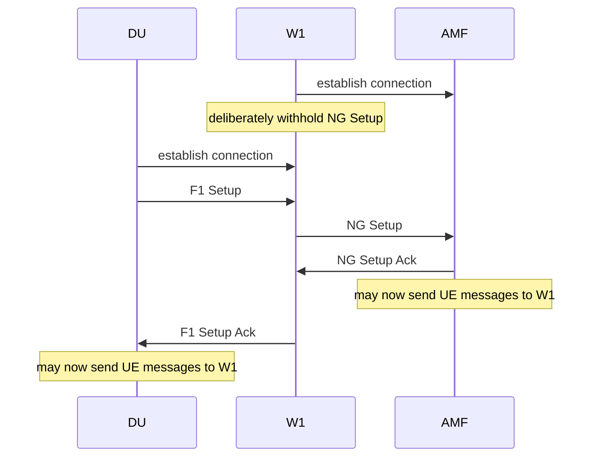
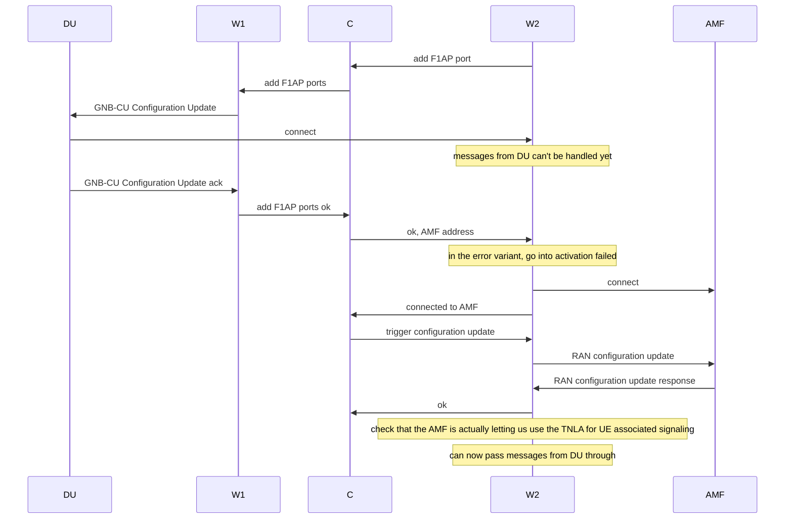
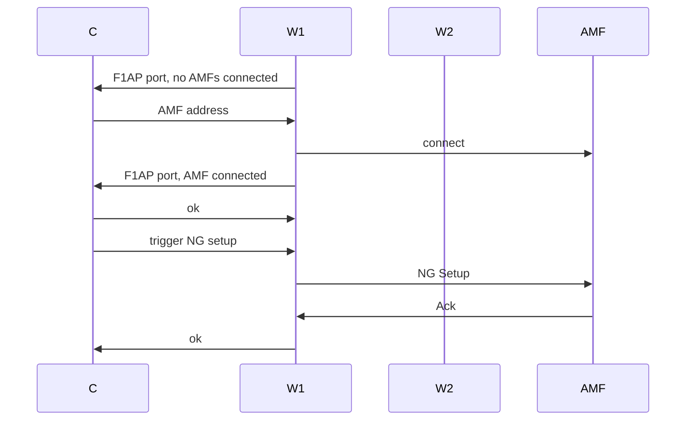
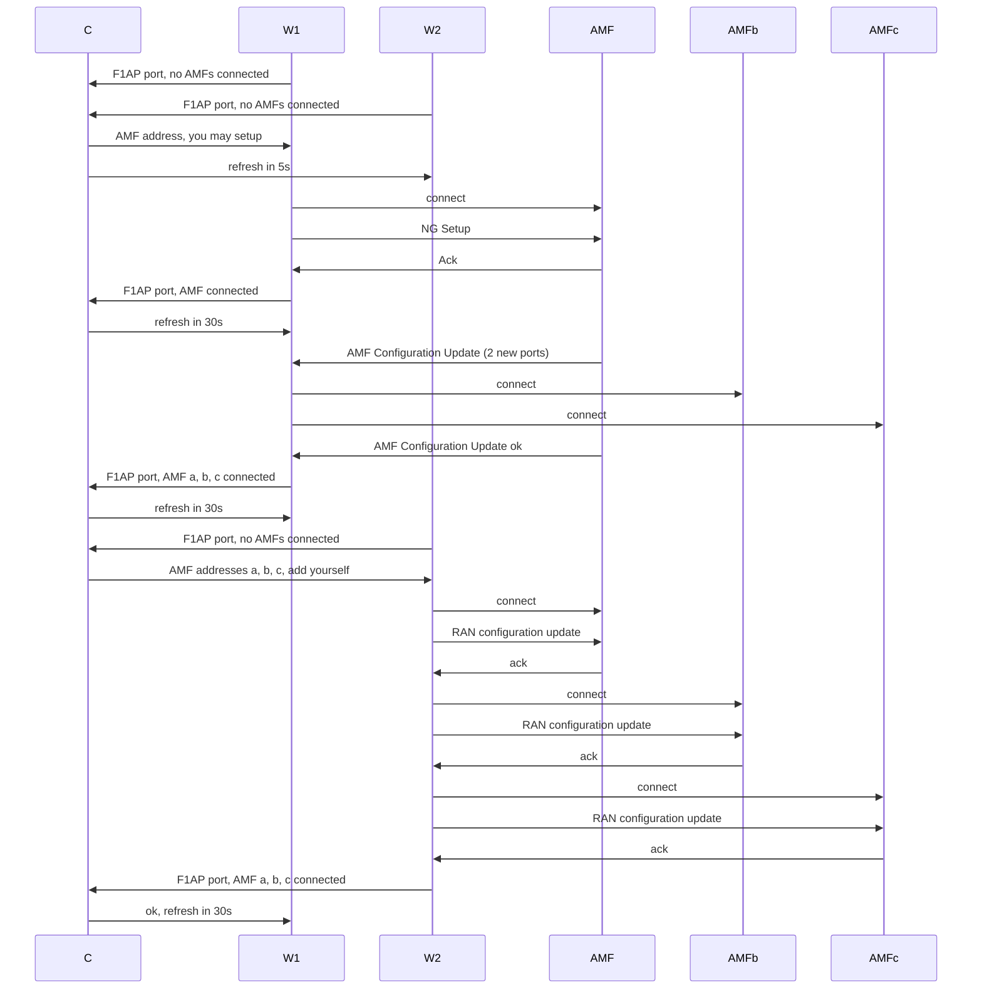

# Connection Management

## Primer on AMF discovery

The starting point is the AMF Set.  Either we get it from the UE (GUAMI, S-TMSI) or from configuration/policy, or from a previous message from the AMF indicating what to do in the event of failure.  (ref 23.501, 6.3.5).

We then use NAPTR to find AMFs in the AMF Set as described in TS 29.303, 7.2.  To quote:

  The S-NAPTR procedure outputs a list of host names (AMFs) each with a service, protocol, port and a list of IPv4 and IPv6 addresses.

The GNB should connect to all AMFs in the AMF Set.  That means finding an address that works, setting up the first TNLA, doing an NG Setup over it, and then letting the AMF instruct it to set up more TNLAs if it so desires.  

Does Kubernetes support NAPTR?  We could set up the same structure in local configuration as a stop gap.

## Non-UE associated signaling

From TS 38.413:

> Between one AMF and NG-RAN node pair ... a single pair of stream identifiers shall be reserved over at least one SCTP association for the sole use of NGAP elementary  procedures that utilize non UE-associated signalling.

A comment on Github suggests that it is normal practice to use stream ID 0 for non-UE associated signaling: [https://github.com/free5gc/free5gc/issues/88#issuecomment-767446612]

So we implement that.

## UE associated signaling

From TS 38.413:
> For a single UE-associated signalling, the NG-RAN node shall use one SCTP association and one SCTP stream, and the SCTP association/stream should not be changed during the communication of the UE-associated signalling until after current SCTP association is failed, or TNL binding update is performed as described in TS 23.502.

i.e. everyone uses the association and stream chosen by the GNB... unless it decides not to.

TS 38.472 has almost identical text for F1AP, and additionally clarifies in TS38.473:
> The F1AP UE TNLA binding is a binding between a F1AP UE association and a specific TNL association for a given UE. After the F1AP UE TNLA binding is created, the gNB-CU can update the UE TNLA binding by sending the F1AP message for the UE to the gNB-DU via a different TNLA. The gNB-DU shall update the F1AP UE TNLA binding with the new TNLA.
The gNB-DU Configuration Update procedure also allows the gNB-DU to inform the gNB-CU that the indicated TNLA(s) will be removed by the gNB-DU.
...perhaps to be used as a quiesce?

F1AP specifies serialization of procedures for a UE.  From TS 38.473:
> Unless explicitly indicated in the procedure specification, at any instance in time one protocol endpoint shall have a maximum of one ongoing F1AP procedure related to a certain UE.
But the equivalent section in the NGAP document doesn't!

## Multiple associations

There are a maximum of 32.  See maxnoofTNLAssociations in NGAP ASN.1 - TS38.413.

### Between GNB-CU and GNB-DU

As described in TS38.401, Multiple TNLAs for F1-C:

- GNB-CU must allow multiple associations from GNB-DU.
- GNB-CU may order GNB-CU to set up multiple associations to it using gNB-CU Configuration Update.

So when we run multiple GNB-CU workers, we send gNB-CU Configuration Update with one address for each one.
Implying that when a new GNB-CU worker starts up, an existing worker must find out about that and send an update.

### Between AMF and GNB-CU

Conversely, the AMF may order us to open multiple associations to it.  Here we have the reverse problem.  A single GNB-CU worker gets an AMF Configuration Update, but each worker should then open a connection to the AMF.  When a worker gets the AMF Configuration Update, it sets up N TNLAs and responds.  

The NG-RAN node is also allow to add endpoints.  So the other workers catch up by adding their own connections and sending RAN CONFIGURATION UPDATE.

> When the configuration with multiple SCTP endpoints per NG-RAN node is supported and the NG-RAN node wants to add additional SCTP endpoints, the RAN configuration update procedure shall be the first NGAP procedure triggered on an additional TNLA of an already setup NG-C interface instance after the TNL association has become operational, and the AMF shall associate the TNLA to the NG-C interface instance using the included Global RAN node ID.

free5GC AMF identifies GNB / creates RAN context by connection.  Each of our workers would manifest as a separate RAN.  So it is never going to do triangular redirection.  And there is no point having a node controller because there is no coordination required.

Open5GS AMF identifies the gNB by address - see amf_gnb_find_by_addr().  Presumably this means it can't do triangular redirection either.  Since both NG Setup and ngap_handle_ran_configuration_update() call amf_gnb_set_gnb_id() the GNB IDs will overwrite each other for the purposes of handover.

If neither of the open source AMFs can cope with multiple parallel connections from same gNB, possibly some of the commerical ones don't either.  It depends on their support for TS 38.412 multi associations.

## Overload

The AMF may order the gNB to reduce the signalling load.  This needs to propagate to all workers.

## Chosen design - Node controller

Considering the following designs to propagate information around the cluster

1. Gossip protocol.  
2. Kubernetes controller ConfigMaps.
3. Additional node controller microservice.

...I went for the last of these.

The idea is that

- the node controller does all non-UE associated signaling and knows about all the TNLAs
- the workers find the node controller using a Kubernetes service
- the node controller needs some synchronization mechanism
  - either a consistent store like etcd
  - or needs to be a singleton pod
  - or needs to be an active-standby.
  
Key example of why a synchronization mechanism is needed is that otherwise two node controller instances might simultaneously try to send NG Setup.

### Interface state information - idea - reject

When the coordinator responds to a worker, it lets the worker know if the NG interface instance is up yet.  This means that the worker can automatously decide whether to send NG Setup or RAN Configuration update.

The problem with this idea is that when two workers come up simultaneously, they will both learn that the interface instance is down and thus both send NG Setup.  Hence this idea is rejected and the following idea is used instead.

### Procedure trigger callback

Worker instances provide a procedure trigger callback.  

When the coordinator learns of a new connection to the AMF, it uses the procedure trigger callback to trigger an NG Setup or RAN configuration update.  Either a single task must be used, or a consistent store.

Decision is to go with a single "Interface management" thread that communicates using channels.

### TNLA handling

TNLAs are stored in the StcpTnlaPool.  Anyone can use this pool to send a message.
A client attempts to maintain one TNLA to each endpoint at all times.  
The client has one task per endpoint, either resolving, or waiting for a retry, or handling the connection.  Connections are added/removed from the pool as they get successfully estalbished / fail / are retracted.  This shows that there is not a 1:1 relationship between connections in the pool and tasks.  Therefore the pool can't store a task handle.
The server has N connections.  These can simply hang off the listen.
When gracefully deleting the client, we signal all of the per endpoint tasks to stop what they are doing and then join the tasks.

### Sequencing of connection establishment - first worker

The goal is to avoid the situation where the first message(s) sent by the AMF to the CU can't be passed onto a DU, and vice versa.

For example, if we fully set up the DU side first, it will send us UE messages but we don't have an AMF connection to pass them on. 



Still, it is possible that right to left messages may overtake the F1 Setup Ack.  Until proven otherwise, we assume that, upon transmission of an F1 Setup, the DU is capable of receiving new requests from the CU.  Similarly, we ensure that, upon transmission of an NG Setup, the CU is capable of receiving new requests from the AMF.

### Sequencing of connection establishment - second worker

Again, the danger is that the new worker receives a message it can't pass on.  Our choice is to get the DU connection set up first.



### Multiple TNLA endpoints from AMF



alternative



### Where we need to connect to multiple AMFs


This is from 29.303.

The AMFs available within an AMF Set should be provisioned within NAPTR records in the DNS, under the AMF Set FQDN (as defined in clause 28.3.2.7 of 3GPP TS 23.003 [4]), with the Service Parameters "x-3gpp-amf:x-n2".
The 5G-AN may discover the AMFs available within an AMF Set by:
-	constructing the AMF Set FQDN, as defined in clause 28.3.2.7 of 3GPP TS 23.003 [4], identifying the AMF Set of the AMFs to be discovered; and
-	initiating an S-NAPTR procedure, with the Application-Unique String set to that AMF Set FQDN, and with the "Service Parameters" set to "x-3gpp-amf:x-n2".


When connecting to an AMF it may provide a backup AMF name per GUAMI in its served GUAMI list.
This is apparently not a DNS name.  So we are going to find it by doing an NG Setup (or getting an AMF configuration update that changes it).

Simple case.  

```mermaid
sequenceDiagram
  participant C

