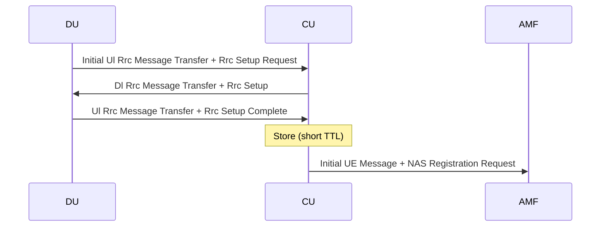
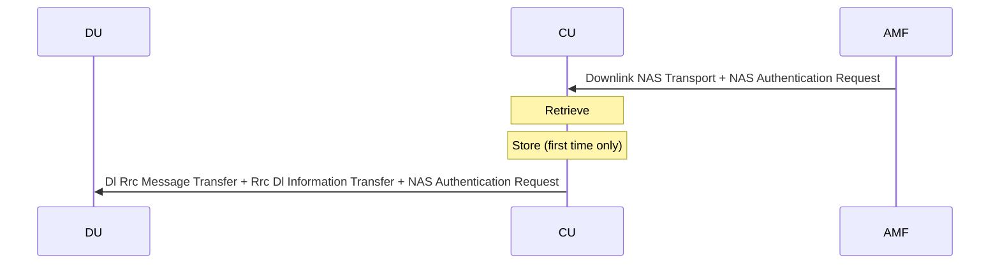
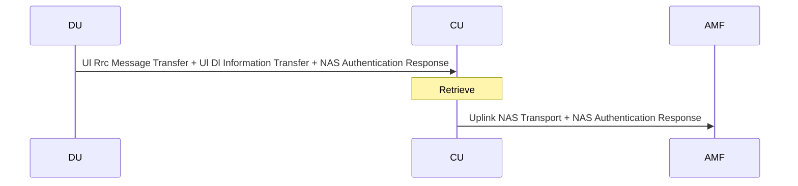
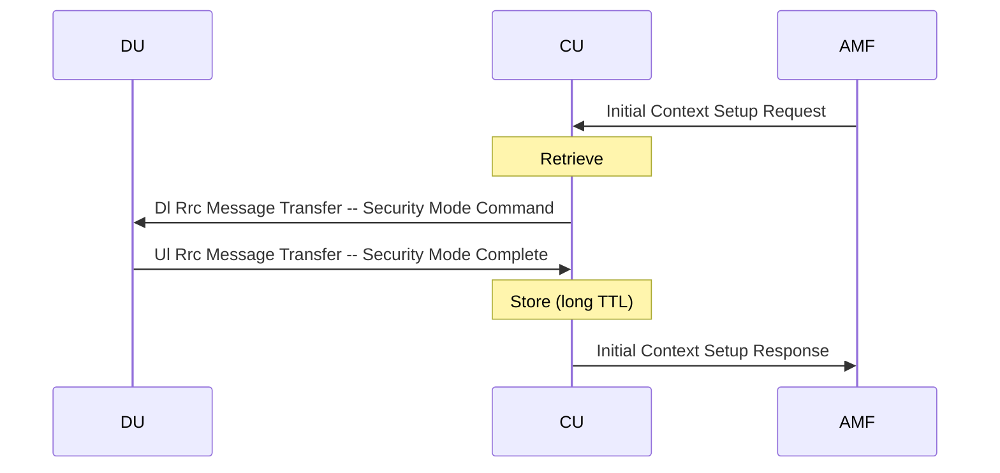

# UE state

This document explains how UE state is managed in Alsoran GNB-CU.

## Combination of UE associations

Section 6.4 of TS38.401 describes various types of UE association.  In Alsoran GNB-CU these are combined into a single block of data that is stored in a separate datastore - the UE state.

## UE state creation

UE associated logical connections are created as part of the UE Initial Access procedure.  See TS38.401, section 6.4 and figure 8.1-1.  The first store of the UE state happens before sending the Initial UE Message to the AMF.  At this point,
we do not have a full UE Context but rather a linked pair of UE-associated logical NG connection and UE-associated logical F1 connection. 

If the CU instance fails during this process, the UE will time out its registration and try again.  (NAS timer T3502)

A collision cannot occur at the 'Store' step provided the CU's UE Id is unique.  If a duplication of this procedure occurs for
the same UE, then two records are created.  We use a fairly short initial TTL so that these records get quickly cleaned up.

From this point, the UE Context may be retrieved for message transfer purposes.  During the initial access sequence, NAS authentication and security get set up in this way, without modifying the UE context. 

Here is the first downlink message transfer, used to carry the NAS Authentication Request.  

The first time Downlink NAS Transport is received, we store the AMF's UE Id.  Subsequent occurences are handled without a store. 

And here is the uplink message transfer used to carry the NAS Authentication Response.

Since the DU is obliged to treat the UE binding to the TNLA as sticky, you could argue that there is no need for a retrieve 
in the flow above. Instead, the CU instance could store the UE context in a local hash.  However, that would be in breach of our
design principle of minimizing failure handling logic.  Doing a retrieve here means that any CU instance can handle this exchange.  Provided the DU is smart enough to pick a new TNLA, processing continues with no impact.

Eventually the AMF furnishes the GNB with enough information to make this a fully fledged UE context.

If the CU fails during this sequence, the AMF will be missing a reply to its Initial Context Setup Request and NAS Registration Accept.  The UE will be missing a reply to its NAS Registration Request.  

The AMF will detect TNLA failure either via the SCTP heartbeat, or when it attempts to retransmit NAS Registration Accept upon expiry of its NAS T3550 timer.  At this point the AMF could
  -  give up, meaning that the retry will be driven by the UE
  -  retry Initial Context Setup Request on another TNLA, which should succeed
  -  send Downlink NAS Transport on another TNLA, which will succeed initially but the absence of the AMF's UE context will cause a later failure.

## TNLA rebinding

The NAS passthrough cases above are shown as requiring a Retrieve and not a Store operation.  This is a simplification.  If the TNLA binding changes on either side of the CU, then these operations also involve a Store.

## Iteration

The cases where the GNB needs to iterate UE Contexts are as follows.

### NG Reset from the AMF

"the NG-RAN node shall release all allocated resources on NG and Uu related to the UE association(s) indicated explicitly or implicitly in the NG RESET message and remove the indicated UE contexts including NGAP ID."  

-  The 'Reset All' variant of this procedure means that the GNB must be able to walk all UE contexts by NGAP interface instance. 

-  It is also problematic that the AMF is at liberty to specify individual connections by AMF UE NGAP ID only (given that RAN UE NGAP ID is optional).

The simplest way to do both of these things is a full walk of the datastore.  

If we only decide to implement the first, we could use a Redis hash per NG interface instance, and simply delete the whole hash.  However, see the next section for why this is not feasible.

### F1 Removal from the DU

According to F1AP TS38.473, 8.2.8.2, the F1 Removal message is sent and responded, then TNLAs are deleted and then resources are freed up.  Like NG Setup, this needs a walk of UE State by F1AP interface instance.  

This means that if we index by F1 interface instance, there is an efficient way of deleting UE state when a DU resets but not when an AMF resets, and if we index by NG interface instance, the reverse is true.  The remaining idea in this vein would be to form a key out of the combination of the two interface instance IDs.  TODO - TBD whether this idea has any merit and is worth implementing.

### Loss of TNLA

When a TNLA fails, all of its TNLA bindings are broken.  This might suggest a walk of UE State by TNLA.  
However, in fact we can instead wait until the UE is looked up for some other reason and rebind it then.
