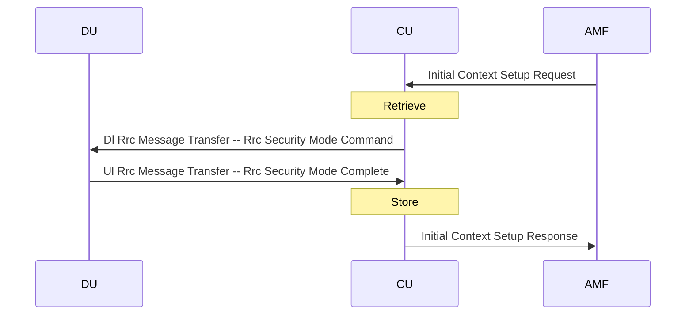

# Registration call flow

5G registration sets up a GNB-CU UE context without a PDU session. 
Since no DRB is needed yet, no context in the DU or CU-UP needs to be created.
The GNB-CU establishes Rrc security on the SRB and then completes the operation.
See O-RAN.WG5.C.1, 6.1.1.2.

