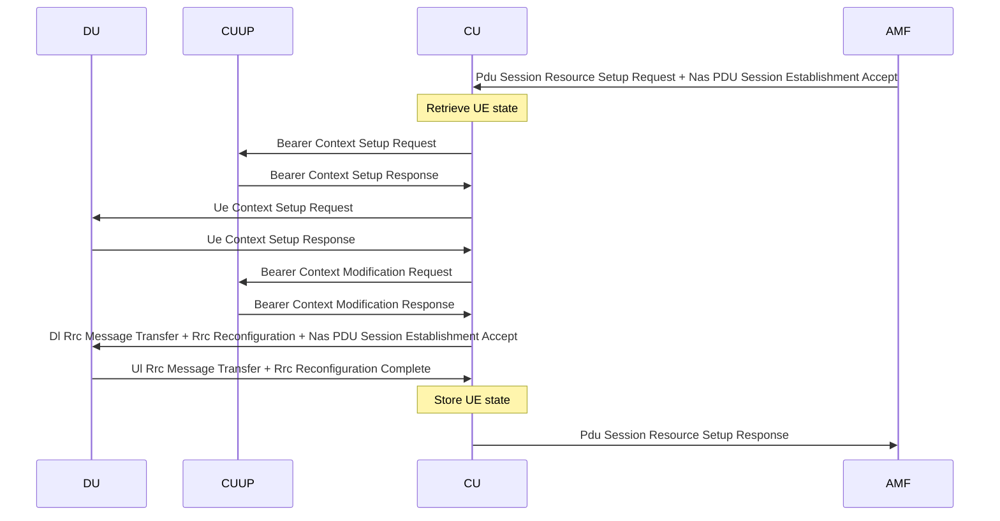

## Session Establishment

### Success case
High level flows from 23.503, 4.3.2.2.1, and 38.300, Annex A.  CU-CP <> CU-UP parts from 38.401, 8.9.2.

Rrc Reconfiguration is deferred until after E1 Bearer Context Modification Response based on the note in 38.401, 8.9.1
> NOTE:	Steps 14-15 and steps 16-17 can happen in parallel, but both are before step 18.

Although this is describing a different procedure, it shows the intent that the user plane should be set up successfully before the Rrc Reconfiguration referencing new DRBs is initiated. 

### Failure cases

No standards ref for this found yet.  

Possible tactics:
-  For case where a request fails, unwind other resources and send session establishment failure.
-  For case where the GNB-CU instance and hence procedure task fails, set a guard timer so that another instance can clean up later.
-  Procedure collision detectable at point of UE state store (CAS optimistic lock style) - or at point of guard timer set (making the timer into a sort of distributed lock).
-  Backstop needs to be userplane inactivity detection in CU-UP and DU.
