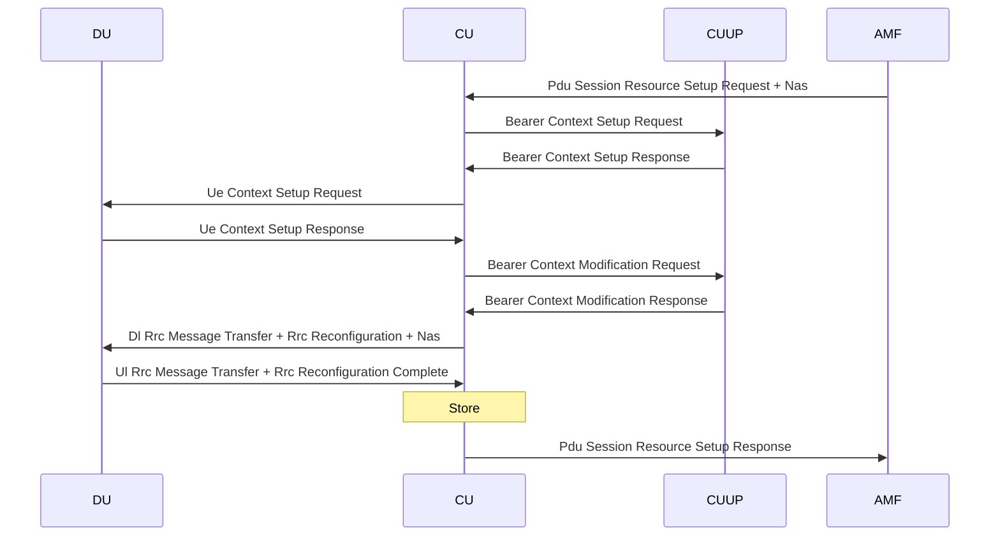

## Session Establishment

High level flow from 38.300, Annex A.  CU-CP <> CU-UP parts from 38.401, 8.9.2.

```mermaid
sequenceDiagram
  participant DU
  participant CU
  participant CUUP
  participant AMF
  AMF->>CU: Pdu Session Resource Setup Request + Nas
  CU->>CUUP: Bearer Context Setup Request
  CUUP->>CU: Bearer Context Setup Response
  CU->>DU: Ue Context Setup Request
  DU->>CU: Ue Context Setup Response
  CU->>CUUP: Bearer Context Modification Request
  CUUP->>CU: Bearer Context Modification Response
  CU->>DU: Dl Rrc Message Transfer + Rrc Reconfiguration + Nas
  DU->>CU: Ul Rrc Message Transfer + Rrc Reconfiguration Complete
  Note over CU: Store
  CU->>AMF: Pdu Session Resource Setup Response
```