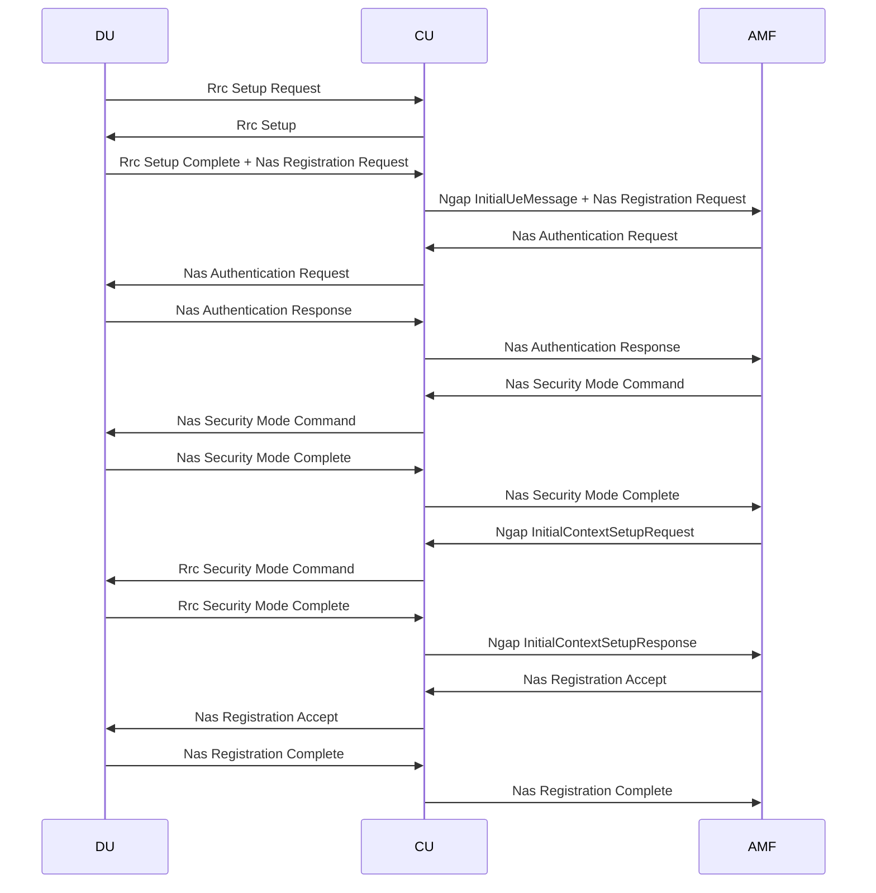

# ODU testing
## Base instructions for getting started 
```sh
~/projects/o-du-l2/build/odu$ make odu MACHINE=BIT64
~/projects/o-du-l2/build/odu$ make cu_stub NODE=TEST_STUB MACHINE=BIT64
~/projects/o-du-l2/build/odu$ make ric_stub NODE=TEST_STUB MACHINE=BIT64

# Set up the addresses.  These match the ones configured in o-du-l2/bin/odu/config/startup_config.xml
sudo ip addr add 192.168.130.80/32 dev eth0 label eth0:RIC_STUB
sudo ip addr add 192.168.130.81/32 dev eth0 label eth0:ODU
sudo ip addr add 192.168.130.82/32 dev eth0 label eth0:CU_STUB

# optional set up tcpdump
sudo tcpdump -w alsoran.pcap -i lo port 38472 or port 38412

# in terminal 1, projects/alsoran/gnb-cu-cp
cargo run -- --local-ip=192.168.130.82

# in terminal 2, projects/o-du-l2
bin/ric_stub/ric_stub

# in terminal 3, projects/o-du-l2
sudo bin/odu/odu

```

## Notes on getting to full flow with amf-sim

### Getting ODU, CU_STUB etc to listen on different IPs

-  startup_config.xml doesn't work (because O1 not enabled)
-  so have to rebuild the code to make it use / connect to a different address

### Problem - SCTP INIT ACK sent from the wrong local IP
Hypothesis - if an SCTP server is listening on a 127.* IP and another local IP exists (e.g. 192.168.130.82), the INIT_ACK will wrongly come from the other local IP.  (Because Linux SCTP multihoming logic is attempting to find and add other local IPs??)

Seems to work if either everything is on 127.* or everything is on non 127.  ODU is going to bind the F1AP port, so needs to be on different address from CU.

Solution: ODU rebuilt to run on 127.0.0.2 and connect to 127.0.0.1.
- rebuild ODU
  - change du_cfg.h as follows 
//#define DU_IP_V4_ADDR "192.168.130.81"
#define DU_IP_V4_ADDR "127.0.0.2" // Nic
//#define CU_IP_V4_ADDR "192.168.130.82"
#define CU_IP_V4_ADDR "127.0.0.1"  // Nic
#define RIC_IP_V4_ADDR "192.168.130.80"
  - touch du_cfg.c
  - run make odu MACHINE=BIT64 in build/odu

- run GNB-CU-CP as follows - the local-ip is needed to stop it binding its F1AP port to 0.0.0.0
  which will cause a bind failure on the ODU: RUST_LOG=debug cargo run --bin gnb-cu-cp -- --local-ip=127.0.0.1
 
## ODU test messages

- uplink are in PHY STUB: 
- downlink are in CU_STUB: src/cu_stub/cu_f1ap_msg_hdl.c

# In terminal 1, projects/alsoran/amf-sim
cargo run

# In terminal 2, projects/alsoran/gnb-cu-cp
redis-server &
cargo run -- --local-ip=127.0.0.1

# in terminal 3, 
```
sudo tcpdump -w alsoran.pcap  -i lo port 38472 or port 38412
```

# in terminal 5, in o-du-l2 directory
(This needs the rebuilt ODU which listens on 127.0.0.2 and connects to 127.0.0.1.)
```
sudo bin/odu/odu
```


# O-DU testing call flow
We start with the standard O-RAN-SC DU test documented at https://github.com/o-ran-sc/o-du-l2 in section F: How to execute.

This test used scripted, hardcoded messages to drive the O-DU.  The uplink Rrc messages are injected by the Phy Stub.  The downlink F1AP messages are injected by the Cu Stub.  

Our strategy is to swap out the Cu Stub, and in its place swap in Alsoran GNB-CU and our simulated AMF (amf-sim).  The result is that we have two real components under test (O-RAN-SC ODU and Alsoran CU) and two scripted mocks (Phy Stub and amf-sim).

To avoid the need to modify the Phy Stub, our amf-sim message sequence is designed to trigger Alsoran CU to produce the same call flow as the O-RAN-SC Cu Stub.  That means the following.

